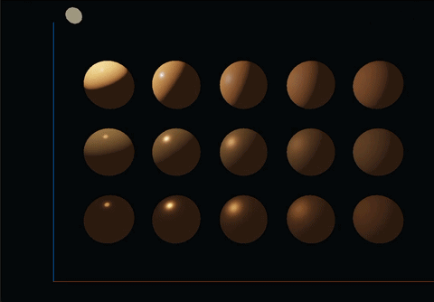
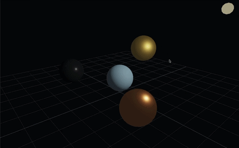
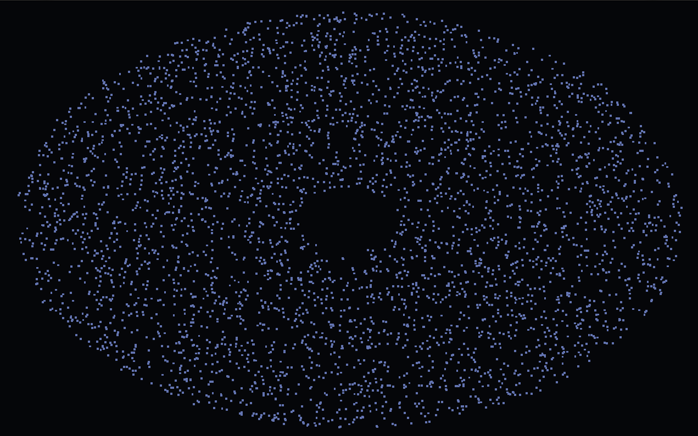
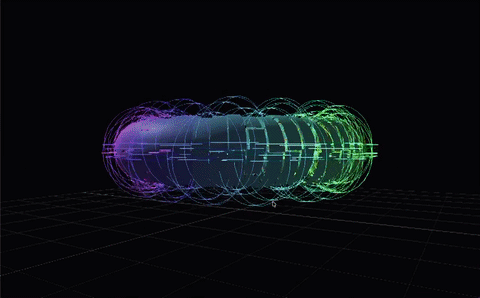
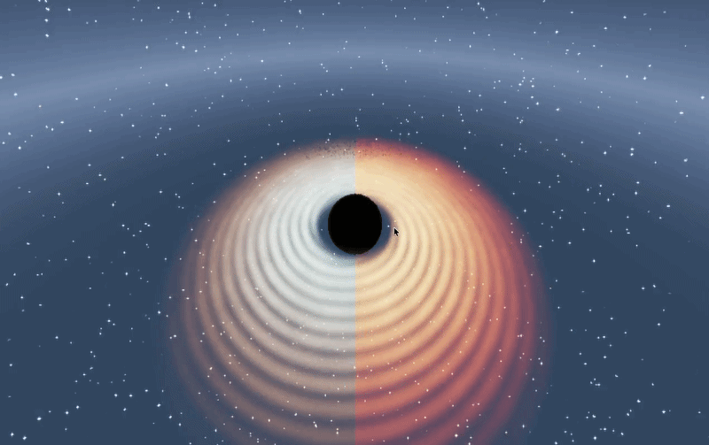

# Welcome to project Elements!

[](http://ElementsProject.readthedocs.io/en/latest/)
[](https://papagiannakis.github.io/Elements)
[](https://arxiv.org/abs/2302.07691)
[](https://opensource.org/licenses/Apache-2.0)

https://user-images.githubusercontent.com/13041399/229489757-f0f3d208-a26d-4fa2-8891-f4d1c7f3aa27.mp4

## About This Fork

This repository is a fork of [papagiannakis/Elements](https://github.com/papagiannakis/Elements).
The original project provides the ECS, scenegraph, OpenGL, GUI, and educational
example foundation; this fork extends it with an SDL3/SDL_GPU based Rendering
Hardware Interface (RHI) and a set of focused RHI teaching examples.

The goal of the fork is to make low-level graphics and compute execution flow
easier for students to inspect: create GPU resources, record commands, submit
work, and see how graphics and compute pipelines exchange data.

## Overview

Elements introduces for the first time the power of the Entity-Component-System (ECS) with the versatility of Scenegraphs, in the context of Computer Graphics (CG), Deep Learning (DL) for Scientific Visualization (SciViz). It also aims to provide the basic tools to anyone that wants to be involved with basic Computer Graphics as well as advanced topics such as Geometric Deep Learning, Geometric Algebra and many many more.

Following a modern educational approach, all related packages are in the Python programming language.

To dive in the details of the project check [its detailed developer documentation](https://elementsproject.readthedocs.io/en/latest/index.html) and the research paper behind this project: [arXiv LINK](https://arxiv.org/abs/2302.07691), [Eurographics LINK](https://diglib.eg.org/handle/10.2312/eged20231015).

## Packages Involved in Elements

* pyECSS: A package for applying ECS to any Scenegraph
* pyGLV : A package applying ECSS to CG, DL and SciViz problems
* pyEEL : A learning hub for various topics where ECSS can be applied

## Getting Started - Installation Instructions

You can still follow the original Elements installation instructions [HERE](https://elementsproject.readthedocs.io/en/latest/source/getting_started/installation.html).
For this fork, use the local setup below so the new RHI examples have the SDL3
and Python dependencies they need.

> [!NOTE]
> We strongly recommend using:
>
> * [Anaconda](https://www.anaconda.com/products/individual) for your python environment,
> * [Visual Studio Code](https://code.visualstudio.com) as your IDE, and
> * [Fork](https://git-fork.com)/[Sourcetree](https://www.sourcetreeapp.com) for version control.

The main steps summarize as follows:

```bash
git clone <this-repository-url>
cd ElementsCustomRenderer

conda create -n elements-rhi python=3.9
conda activate elements-rhi

pip install -e .
```

SDL_GPU requires a supported graphics backend. On macOS this normally means
Metal support through SDL3; on Linux or Windows it normally means a recent
Vulkan or Direct3D 12 capable driver.

Run examples from the repository root:

```bash
python Elements/examples/1.Introductory/example_8_rhi_graphics_pipeline_basic.py
python Elements/examples/1.Introductory/example_9_rhi_compute_pipeline_basic.py
python Elements/examples/3.Advanced/example_18_rhi_compute_particles.py
python Elements/examples/3.Advanced/example_19_rhi_black_hole_pathtraced_volume.py
```

If `SDL_CreateGPUDevice` reports that no supported backend was found, check that
your installed SDL3 build includes the GPU backend for your platform and that
your graphics driver supports it.

## What This Fork Adds

### RHI Core

* SDL3/SDL_GPU device creation with backend-aware shader format selection.
* RHI window and surface setup with swapchain acquisition and render-pass helpers.
* Recorded command buffers for graphics and compute command submission.
* Graphics pipeline creation with shader resources, render passes, primitive drawing, indexed drawing, and storage-buffer reads.
* Compute pipeline creation with dispatch, storage-buffer binding, storage-texture binding, and compute uniform data.
* GPU buffer upload and CPU readback through transfer buffers.
* Texture and sampler resource creation through the RHI `ResourceManager`.
* Fragment texture/sampler binding so graphics passes can sample compute-generated textures.
* RHI keyboard, mouse, wheel, resize, quit, and close event handling.

### RHI Examples

* [Example 7](./Elements/examples/1.Introductory/example_7_rhi_input_events.py): Shows the RHI input and event API.
* [Example 8](./Elements/examples/1.Introductory/example_8_rhi_graphics_pipeline_basic.py): Shows a minimal graphics pipeline that draws one triangle.
* [Example 9](./Elements/examples/1.Introductory/example_9_rhi_compute_pipeline_basic.py): Shows a minimal compute pipeline that writes a GPU buffer and reads it back.
* [Example 15](./Elements/examples/3.Advanced/example_15_rhi_pbr_materials.py): Shows RHI physically based materials with metallic and roughness variation.
* [Example 16](./Elements/examples/3.Advanced/example_16_rhi_pbr_camera_control.py): Shows RHI PBR rendering with orbit, pan, and zoom camera controls.
* [Example 17](./Elements/examples/3.Advanced/example_17_rhi_meshlet_imitation.py): Shows meshlet-style clustered drawing and bounds visualization.
* [Example 18](./Elements/examples/3.Advanced/example_18_rhi_compute_particles.py): Shows compute updating a storage buffer that graphics renders as particles.
* [Example 19](./Elements/examples/3.Advanced/example_19_rhi_black_hole_pathtraced_volume.py): Shows compute writing an HDR texture that graphics tone-maps to the window.

### RHI Example Previews

| Example | Preview |
| --- | --- |
| [Example 15: RHI PBR Materials](./Elements/examples/3.Advanced/example_15_rhi_pbr_materials.py) |  |
| [Example 16: RHI PBR Camera Control](./Elements/examples/3.Advanced/example_16_rhi_pbr_camera_control.py) |  |
| [Example 17: RHI Meshlet Imitation](./Elements/examples/3.Advanced/example_17_rhi_meshlet_imitation.py) |  |
| [Example 18: RHI Compute Particles](./Elements/examples/3.Advanced/example_18_rhi_compute_particles.py) |  |
| [Example 19: RHI Black Hole Path-Traced Volume](./Elements/examples/3.Advanced/example_19_rhi_black_hole_pathtraced_volume.py) |  |

## Folder Structure

* [docs](./docs): Files used to generate the [documentation](https://elementsproject.readthedocs.io/en/latest/index.html)
* [Elements](./Elements/): Contains all the source code of Elements
  * [examples](./Elements/examples): Example files related to pyECSS
  * [features](./Elements/features): Features extending basic functionality of Elements
    * [BasicShapes](./Elements/features/BasicShapes): Quickly add basic shapes (cubes, spheres, cones) to the scene with helper functions
    * [GA](./Elements/features/GA): Files related to Geometric Algebra(GA) and GA-based components-systems
    * [Gizmos](./Elements/features/Gizmos): Introducing Unity-like Gizmos to the Elements, for object manipulation
    * [SkinnedMesh](./Elements/features/SkinnedMesh): Visualize skinned meshes by applying the animation equation
    * [Slicing](./Elements/features/Slicing): Visualize sliced version of a 3D object
    * [Voronoi2D](./Elements/features/Voronoi2D): Visualize the Voronoi diagram of 2D points
    * [bezier](./Elements/features/bezier): Visualize a 3D bezier curve
    * [plane_fitting](./Elements/features/plane_fitting): Visualize the plane that best fits on a set of points
    * [plotting](./Elements/features/plotting): Plot a 2D or 3D function
    * [rigid_body_animation](./Elements/features/rigid_body_animation): Animate a skinned mesh (preliminary version)
    * [usd](./Elements/features/usd): Enable loading/saving using Pixar's Universal Scene Descriptor (USD) format
  * [files](./Elements/files): Static files required
    * [atlas_files](./Elements/files/atlas_files): Required for the Classification and Generative AI examples/notebooks
    * [models](./Elements/files/models): Various 3D models, static or rigged
    * [scenes](./Elements/files/scenes): Scenes in USD format
    * [scv](./Elements/files/scv): Various SCV files
    * [shaders](./Elements/files/shaders): Various shader files
    * [textures](./Elements/files/textures): Various texture files
  * [pyECSS](./Elements/pyECSS): Contains all the source code for pyECSS - Entity, Component, System, Scenegraph functionality
    * [tests](./Elements/pyECSS/tests): Test files for pyECSS
  * [pyGLV](./Elements/pyGLV): Contains all the source code for pyGLV - graphics, shading, imgui functionality
    * [tests](./Elements/pyGLV/tests): Test files for pyGLV
    * [GL](./Elements/pyGLV/GL): The basic Graphics Library files (Scene, Shader, Texture, VertexArray)
    * [GUI](./Elements/pyGLV/GUI): Files related to the window and GUI instantiation.
  * [pyEEL](./Elements/pyEEL): The pyEEL learning hub
    * [notebooks](./Elements/pyEEL/notebooks): Contains all the jupyter notebooks of pyEEL
      * [SciCom](./Elements/pyEEL/notebooks/SciCom): Scientific Computation related notebooks
      * [neuralCG](./Elements/pyEEL/notebooks/neuralCG): Neural networks in CG related notebooks
      * [DL](./Elements/pyEEL/notebooks/DL): Deep Learning related notebooks
      * [CG](./Elements/pyEEL/notebooks/CG): Computer Graphics (CG) related notebooks
      * [GATE](./Elements/pyEEL/notebooks/GATE): Geometric Algebra Transformation Engine related notebooks
  * [utils](./Elements/utils): Utility files and functions for Elements

## Contribute to Elements`</h2>`

If you want to contribute to Elements, kindly check its [WIKI](https://github.com/papagiannakis/Elements/wiki)
for a list of potential projects and a contribution guide. A list of contributors can be found [here](https://github.com/papagiannakis/Elements/wiki/Contributors).

## Contact Us

If you have any questions or would like to learn more about our project, please don't hesitate to [contact us](mailto:papagian@ics.forth.gr).

## Citation

If you are using the Elements project, please cite:

```
@inproceedings {Elements2023,
booktitle = {Eurographics 2023 - Education Papers},
editor = {Magana, Alejandra and Zara, Jiri},
title = {{Project Elements: A Computational Entity-component-system in a Scene-graph Pythonic Framework, for a Neural, Geometric Computer Graphics Curriculum}},
author = {Papagiannakis, George and Kamarianakis, Manos and Protopsaltis, Antonis and Angelis, Dimitris and Zikas, Paul},
year = {2023},
publisher = {The Eurographics Association},
ISSN = {1017-4656},
ISBN = {978-3-03868-210-3},
DOI = {10.2312/eged.20231015}
}
```
